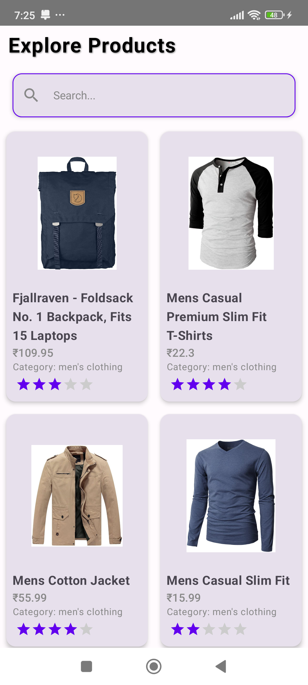

# ProductViewerApp

## **Overview**

**ProductViewerApp** is an Android application designed to display a list of products fetched from a
remote server. The app provides a user-friendly interface for browsing and filtering products.

---

## **Key Features**

- **Product List**: Displays products with essential details such as title, price, category, and
  rating.
- **Search Functionality**: Allows users to search for products by title.
- **Pull-to-Refresh**: Swipe to refresh the product list.
- **Error Handling**: Display appropriate error messages when there is no internet connection or
  server errors.
- **Image Loading**: Efficient image loading using **Coil**.

---

## **Technologies Used**

- **Jetpack Compose**: For building the UI in a modern and declarative way.
- **Retrofit**: For making network requests and handling API responses.
- **Coil**: For image loading.
- **Accompanist SwipeRefresh**: To implement pull-to-refresh functionality.

---

## **Project Structure**

The project follows approach with different layers for models, network, utilities, and view models.
Below is a breakdown of the project structure:

### **1. Model**

Located in `com.example.productviewerapp.model/`

- **Product.kt**: This model represents the **Product** entity, holding data such as title, price,
  category, etc.
- **Rating.kt**: This model represents the **Rating** entity, which includes the rating score and
  number of reviews for each product.

### **2. Network**

Located in `com.example.productviewerapp.network/`

- **ApiService.kt**: This interface defines Retrofit methods for making network requests to get the
  product data from the API.
- **RetrofitInstance**: A singleton object that initializes the **Retrofit** client for network
  calls.

### **3. Utilities**

Located in `com.example.productviewerapp.utlis/`

- **CommonValues**: This class defines static values, such as messages and constants (e.g., grid
  counts).
- **ConnectionState**: A class used to monitor and represent the network connection status, whether
  available or unavailable.
- **Helper**: A utility class containing common functions like rendering headers, showing "No Data
  Found", and displaying network status messages.
- **NetworkUtil**: This class checks the network connection using the current state of the network.

### **4. ViewModel**

Located in `com.example.productviewerapp.viewmodel/`

- **ProductViewModel**: This **ViewModel** is responsible for fetching the product list from the API
  and managing the UI state. It provides the following methods:
    - **fetchProducts()**: Makes a network call to fetch product data and handles any exceptions.
    - **filterProductsByTitle()**: Filters the product list based on the search query (search by
      title).

---

# MainActivity Overview

## **Features**

### 1. **Product List Display**

The app uses a **LazyVerticalGrid** to display products in a clean grid layout. This allows for
smooth scrolling of product items.

### 2. **Search Bar**

The app includes a **search bar** that allows users to filter products in real-time based on the
title. The displayed products are updated dynamically as the user types in the search query.

### 3. **Network Connectivity Check**

The app checks the device’s network connectivity using **connectivityState**. If no internet
connection is available, the app displays appropriate messages, handling scenarios like network
unavailability or timeouts.

### 4. **Swipe to Refresh**

The app supports the **Swipe-to-Refresh** gesture, which allows users to refresh the product list by
simply swiping down on the screen. This triggers a re-fetch of data from the API.

### 5. **Loading Indicators**

While the data is being fetched from the API, a **circular progress indicator** is displayed to
inform the user that the app is loading the content.

### 6. **Error Handling**

The app provides **error handling** using a **Snackbar**. If any network issues or API failures
occur, an error message is displayed to notify the user.

---

## **ProductCard**

Each product is displayed within a **Card** that includes the following information:

- **Title**: The name of the product.
- **Price**: The product's price is shown in a styled format.
- **Category**: The category to which the product belongs.
- **Image with Loading**: A product image is displayed with a loading indicator until the image is
  successfully loaded.
- **Rating**: Displays the product’s rating with visual representation (using stars).

The **ProductCard** is designed to give a concise yet comprehensive overview of each product,
ensuring a pleasant user experience while browsing the product catalog.

---

## **Installation**

1. Clone the repository:
    ```bash
    git clone https://github.com/GK27/ProductViewerApp.git
    ```

2. Open the project in **Android Studio**.

3. Build and run the app on an emulator or physical device.

---

## **Usage**

Once the app is launched, users can browse the list of products. You can filter products by typing
in the search bar. If no products are found, a "No Data Found" message will be displayed. You can
also pull-to-refresh the list of products to get the latest data.

---

## **Screenshots**

Add images of your app here for better visualization.

1. **App logo**
   

2. **Product List Screen**
   

3. **Product Filter Screen**
   

4. **Network Check Screen**
   

---


